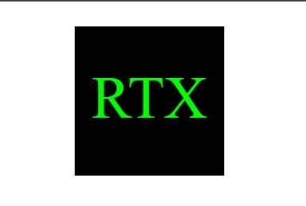
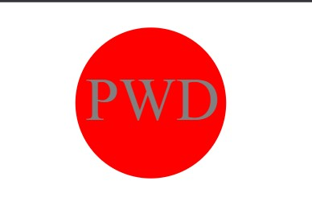
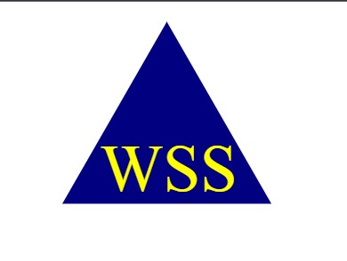

# logo-generator
This project uses Node.js to create a Scalable Vector Graphic (SVG). It uses inquirer to take in input from 
the user and creates a simple logo under their specified parameters.

### User Story

```md
AS a freelance web developer
I WANT to generate a simple logo for my projects
SO THAT I don't have to pay a graphic designer
```

## Acceptance Criteria

```md
GIVEN a command-line application that accepts user input
WHEN I am prompted for text
THEN I can enter up to three characters
WHEN I am prompted for the text color
THEN I can enter a color keyword (OR a hexadecimal number)
WHEN I am prompted for a shape
THEN I am presented with a list of shapes to choose from: circle, triangle, and square
WHEN I am prompted for the shape's color
THEN I can enter a color keyword (OR a hexadecimal number)
WHEN I have entered input for all the prompts
THEN an SVG file is created named `logo.svg`
AND the output text "Generated logo.svg" is printed in the command line
WHEN I open the `logo.svg` file in a browser
THEN I am shown a 300x200 pixel image that matches the criteria I entered
```
## Video Demonstration
Below is a link to the demo of the app, or you may scan the QR code:

<a href='https://drive.google.com/file/d/1R1O9I5paMUdKAKVh6ZEOkhui1jU8U5Mq/view'>Click me to view walkthrough!</a>


## Examples







